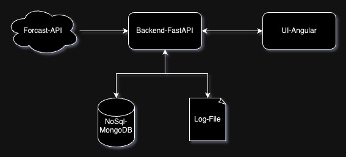

# Weather Forcast API

### System Prerequisites:

- **MongoDB**:  create `temperature` collection under the `weatherdata` DB.
- **Docker**: should be pre-installed on the system.

### High Level Diagram of the implementation:

---

### Command to build Docker image:

Go the cloned directory of this project and build the docker image for backend as,

`docker build --no-cache -t forcast_api .`

Once the image is created, Please up the container by,

`docker compose up`

Then the documentation and playground will serve in the 8000 port.

- Documentation: http://localhost:8000/documentation
- Playground: http://localhost:8000/playground

